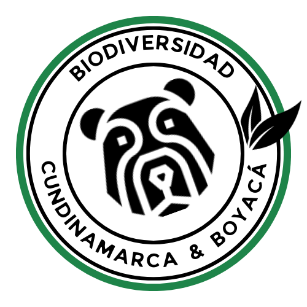

# Página de Biodiversidad en Cundinamarca y Boyacá



## Descripción

Este proyecto es una página web dedicada a la biodiversidad en las regiones de Cundinamarca y Boyacá. La página está diseñada para ser educativa e informativa, destacando la diversidad biológica en estas dos regiones específicas de Colombia. 

## Características

- **Responsive Design:** La página se adapta a diferentes tamaños de pantalla y dispositivos.
- **Vistas Específicas:** Contiene dos vistas principales, una para la biodiversidad en Cundinamarca y otra para Boyacá.
- **Contenido Visual:** Incluye imágenes y descripciones detalladas de la fauna y flora de cada región.
- **Interactividad:** Elementos interactivos implementados con Bootstrap 5.

## Tecnologías Utilizadas

- HTML5
- CSS3
- Bootstrap 5

## Instalación

1. Clona el repositorio:
    ```sh
    git clone https://github.com/tuusuario/pagina-de-biodiversidad.git
    ```
2. Navega al directorio del proyecto:
    ```sh
    cd pagina-de-biodiversidad
    ```
3. Abre el archivo `index.html` en tu navegador preferido.

## Estructura del Proyecto

```plaintext
pagina-de-biodiversidad/
├── index.html
├── page2.html
├── img/
│   └── (imágenes del proyecto)
├── styles/
│   └── styles.css
└── README.md
